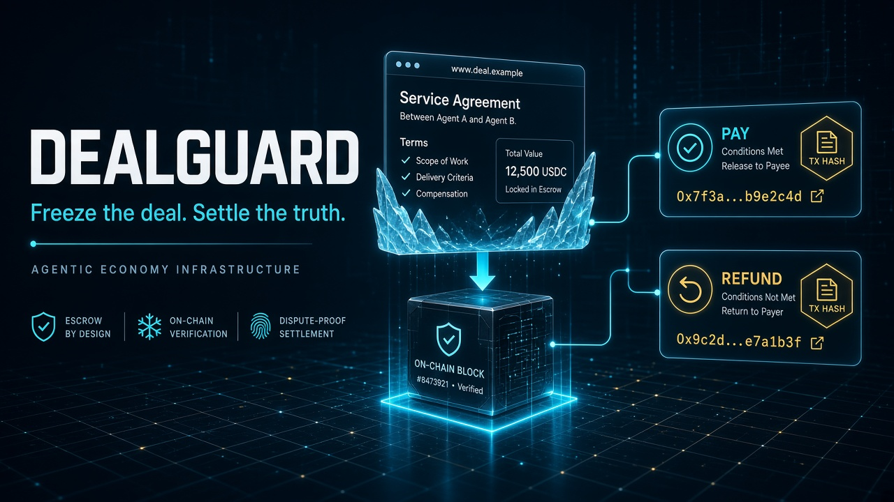
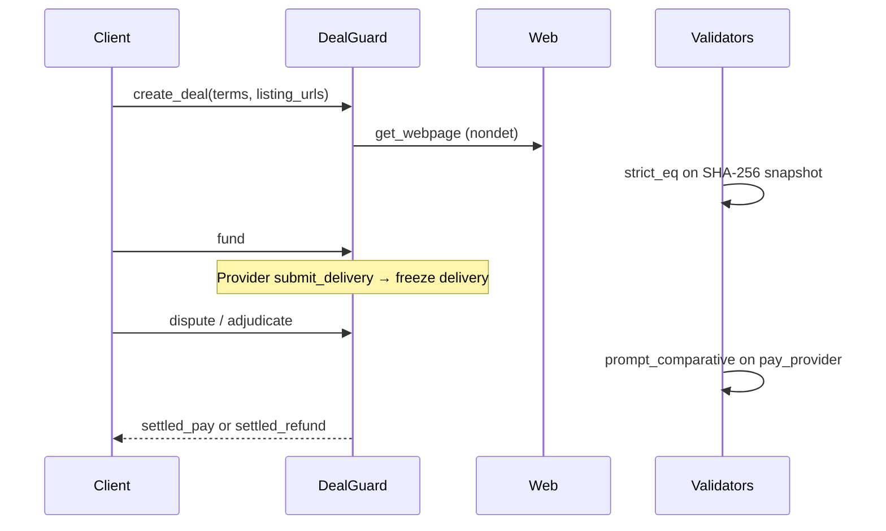

# DealGuard

<p align="center">
  
</p>

<p align="center">
  <strong>Agentic commerce escrow that adjudicates frozen web evidence — not rotting live URLs.</strong>
</p>

<p align="center">
  
  
  
</p>

---

## Why it exists

Agents already buy, sell, and dispute from the open web. Between deal open and adjudication the listing changes, the delivery page rotates, or an attacker swaps the URL. That is **URL rot** — and most escrow still points judges at live links.

**DealGuard** is the missing commerce primitive:

1. **Freeze** listing URLs at deal open (SHA-256 + validator consensus)
2. **Escrow** bookkeeping units until delivery
3. **Freeze** delivery evidence when the provider submits
4. **Adjudicate** with GenLayer LLMs against **frozen** snapshots only
5. **Cross-check** later to prove drift / tamper
6. **Score** party reputation from outcomes

Not another wrapper agent. Infrastructure other agent marketplaces compose.



---

## Features

| Capability | Detail |
|---|---|
| `create_deal` | Freeze up to 6 listing `https://` URLs under `eq_principle_strict_eq` |
| `fund` | Lock client bookkeeping units into escrow |
| `submit_delivery` | Provider freezes delivery evidence |
| `release` | Happy-path payout |
| `dispute` + `adjudicate` | LLM judges frozen listing+delivery vs natural-language terms |
| `cross_check` | Prove SHA-256 drift on listing or delivery |
| Reputation | wins / losses / score per address |
| Studio-safe | JSON string state; owner as ctor arg |

---

## Live Studionet deploy

| Item | Link |
|------|------|
| **Contract** | [`0xe8D6d1D1f81790e17C5Bd3436C5277E8C401B02D`](https://explorer-studio.genlayer.com/address/0xe8D6d1D1f81790e17C5Bd3436C5277E8C401B02D) |
| **Deploy tx** | [`0x09b84e3b…`](https://explorer-studio.genlayer.com/tx/0x09b84e3ba39a88b1fbb2d2cdd8df994877f3444864827d88023caae83a67b5c3) |
| **pin_code_snapshot** | [`0x0d17d1ef…`](https://explorer-studio.genlayer.com/tx/0x0d17d1effc69a47718283014b3d0b941a174cb9db896db7aa239c3ac01d45c11) |
| **create_deal(demo-1)** | [`0xdb2e5980…`](https://explorer-studio.genlayer.com/tx/0xdb2e59803482ea0ff10d11bbc128f5b6323c131808d88d7a4bc2063a0d9310e7) |
| **store_evidence** | [`0x0cd0bd31…`](https://explorer-studio.genlayer.com/tx/0x0cd0bd31256e670deb6e4418cd8d94d96b83452d4d2551500eee6337cdf224fc) |
| **Full record** | [`DEPLOY.md`](DEPLOY.md) |

Verified reads: `get_code_snapshot`, `get_criteria_template`, `get_deal("demo-1")`, `get_evidence("demo-1")`.

---

## Quick start (GenLayer Studio)

1. Open [studio.genlayer.com/contracts](https://studio.genlayer.com/contracts)
2. Paste [`contracts/DealGuard.py`](contracts/DealGuard.py)
3. Deploy with constructor = your wallet `0x…`
4. Follow [`examples/demo_flow.md`](examples/demo_flow.md)

Demo fixture URL:

```json
["https://test-server.genlayer.com/static/genvm/hello.html"]
```

---

## API (summary)

See full method map: [`contracts/README.md`](contracts/README.md)

| Write | View |
|---|---|
| `credit`, `create_deal`, `fund`, `submit_delivery` | `get_deal`, `list_deals` |
| `release`, `dispute`, `adjudicate`, `cross_check` | `get_balance`, `get_reputation`, `get_stats` |

---

## Agent Tank integrity pack

| Piece | Location |
|---|---|
| Code snapshot | [`CODE_SNAPSHOT.json`](CODE_SNAPSHOT.json) · `pin_code_snapshot` |
| Evidence schema | [`schemas/condition_met.schema.json`](schemas/condition_met.schema.json) |
| Criteria template | [`templates/deal_evidence.json`](templates/deal_evidence.json) · `get_criteria_template` |
| CI | [`.github/workflows/ci.yml`](.github/workflows/ci.yml) |
| CLI | `python3 scripts/cli.py …` |
| Evidence UI | `/evidence` on the product site |
| Docs | [`docs/AGENT_TANK.md`](docs/AGENT_TANK.md) |

```bash
python3 scripts/update_code_snapshot.py verify
python3 -m pytest -q
python3 scripts/cli.py evidence generate
```

---

## Site

**Live (GitHub Pages):** https://valentinzubok.github.io/DealGuard/

| Path | Purpose |
|------|---------|
| `/` | Landing + product map + Studio CTA |
| `/how-it-works/` | Architecture sequence |
| `/quickstart/` | Studio steps + mock screenshots |
| `/evidence-explorer/` | Interactive integrity pack |
| `/features/` · `/use-cases/` | Capabilities + scenarios |
| `/api-reference/` · `/security/` · `/changelog/` | Reference |
| `/demo/` · `/evidence/` · `/docs/` · `/reputation/` | Tools |

Local: `cd web && npm run dev`. Pages build uses `NEXT_PUBLIC_BASE_PATH=/DealGuard`.


---

## Agent Tank

Track: **Agentic Commerce Infrastructure**  
Portal notes: [`SUBMIT.md`](SUBMIT.md)

---

## License

Released under the [MIT License](LICENSE.md). © 2026 Valentyn Zubok
