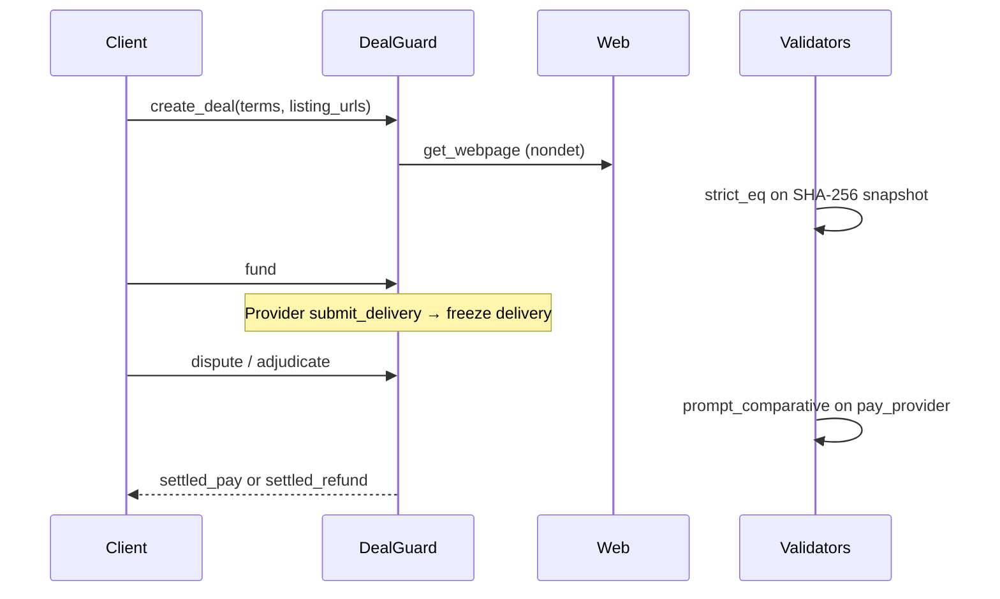

# DealGuard

<p align="center">
  
</p>

<p align="center">
  <strong>Agentic commerce escrow that adjudicates frozen web evidence — not rotting live URLs.</strong>
</p>

<p align="center">
  <a href="https://valentinzubok.github.io/DealGuard/"></a>
  <a href="https://explorer-studio-dev.genlayer.com/address/0x0e4619B776f849F0527B32DA86c0ED13c8841AB6"></a>
  <a href="https://valentinzubok.github.io/DealGuard/console/"></a>
</p>

<p align="center">
  
  
  
  
</p>

| | |
|---|---|
| **Website** | https://valentinzubok.github.io/DealGuard/ |
| **Contract (Studio Dev, chain 61997)** | [`0x0e4619B776f849F0527B32DA86c0ED13c8841AB6`](https://explorer-studio-dev.genlayer.com/address/0x0e4619B776f849F0527B32DA86c0ED13c8841AB6) · [deploy record](STUDIO_DEV_DEPLOY.md) |
| **Live app** | https://valentinzubok.github.io/DealGuard/console/ — MetaMask reads/writes the contract |
| **Studio** | https://studio-dev.genlayer.com/run-debug |
| **Quickstart** | [Site guide](https://valentinzubok.github.io/DealGuard/quickstart/) · [`docs/STUDIO.md`](docs/STUDIO.md) |
| **Evidence explorer** | https://valentinzubok.github.io/DealGuard/evidence-explorer/ |
| **Changelog** | [`CHANGELOG.md`](CHANGELOG.md) · [site](https://valentinzubok.github.io/DealGuard/changelog/) |

---

## Why it exists

Agents already buy, sell, and dispute from the open web. Between deal open and adjudication the listing changes, the delivery page rotates, or an attacker swaps the URL. That is **URL rot** — and most escrow still points judges at live links.

**DealGuard** is the missing commerce primitive:

1. **Freeze** listing URLs at deal open (SHA-256 + validator consensus)
2. **Escrow** bookkeeping units until delivery
3. **Freeze** delivery evidence when the provider submits
4. **Adjudicate** with GenLayer LLMs against **frozen** snapshots only
5. **Cross-check** later to prove drift / tamper
6. **Score** party reputation from outcomes

Not another wrapper agent. Infrastructure other agent marketplaces compose.



---

## Stack (what this repo is)

| Layer | Tech | Notes |
|-------|------|--------|
| Intelligent Contract | Python GenLayer IC | [`contracts/DealGuard.py`](contracts/DealGuard.py) — **not** Solidity / genlayer-js SPA |
| Integrity pack | JSON + schemas + CI | `CODE_SNAPSHOT.json`, `schemas/`, `scripts/` |
| Product site | **Next.js 15 + TypeScript** static export | `web/` → GitHub Pages (`/DealGuard` basePath) |
| CI / CD | GitHub Actions | [`.github/workflows/ci.yml`](.github/workflows/ci.yml) + [Pages](.github/workflows/pages.yml) |

---

## Getting Started

### 1) Clone & verify contract tests

```bash
git clone https://github.com/valentinzubok/DealGuard.git
cd DealGuard
python3 -m pip install -r requirements-dev.txt
python3 scripts/update_code_snapshot.py verify
python3 scripts/validate_schemas.py
python3 -m pytest -q
```

### 2) Run the website locally

```bash
cd web
npm install
npm run dev
# → http://localhost:3010
```

Optional typecheck:

```bash
cd web && npx tsc --noEmit
```

For a Pages-like build (with basePath):

```bash
cd web
NEXT_PUBLIC_BASE_PATH=/DealGuard NEXT_BASE_PATH=/DealGuard npm run build
# static files in web/out/
```

No `.env` is required: the app defaults to the live Studio Dev contract `0x0e4619B776f849F0527B32DA86c0ED13c8841AB6` (override with `NEXT_PUBLIC_DEALGUARD_ADDRESS`). Open `/console/` and connect MetaMask — it switches to chain 61997.

### 3) Deploy / use the live demo on Studio

1. Open [GenLayer Studio Dev](https://studio-dev.genlayer.com/run-debug) (chain 61997)
2. Paste [`contracts/DealGuard.py`](contracts/DealGuard.py) **or** use the [already-deployed contract](https://explorer-studio-dev.genlayer.com/address/0x0e4619B776f849F0527B32DA86c0ED13c8841AB6) from the [live console](https://valentinzubok.github.io/DealGuard/console/)
3. Follow [Quickstart on the site](https://valentinzubok.github.io/DealGuard/quickstart/) or [`examples/demo_flow.md`](examples/demo_flow.md)

Demo listing URL:

```json
["https://test-server.genlayer.com/static/genvm/hello.html"]
```

**Pitch path (read-only, no second wallet):** `get_code_snapshot` → `get_criteria_template` → `get_deal("demo-1")` → `get_evidence("demo-1")`. See [`DEPLOY.md`](DEPLOY.md).

---

## Features

| Capability | Detail |
|---|---|
| `create_deal` | Freeze up to 6 listing `https://` URLs under `eq_principle_strict_eq` |
| `fund` | Lock client bookkeeping units into escrow |
| `submit_delivery` | Provider freezes delivery evidence |
| `release` | Happy-path payout |
| `dispute` + `adjudicate` | LLM judges frozen listing+delivery vs natural-language terms |
| `cross_check` | Prove SHA-256 drift on listing or delivery |
| Reputation | wins / losses / score per address |
| Studio-safe | JSON string state; owner as ctor arg |

Full tables: [Features](https://valentinzubok.github.io/DealGuard/features/) · [API reference](https://valentinzubok.github.io/DealGuard/api-reference/)

---

## Live Studio Dev deploy (chain 61997)

| Item | Link |
|------|------|
| **Contract** | [`0x0e4619B776f849F0527B32DA86c0ED13c8841AB6`](https://explorer-studio-dev.genlayer.com/address/0x0e4619B776f849F0527B32DA86c0ED13c8841AB6) |
| **Source check** | on-chain code sha256 = `d69a3444…96ad` = `contracts/DealGuard.py` |
| **Lifecycle txs** | deploy → credit → create_deal → fund → submit_delivery → release; dispute → adjudicate (LLM) — see [`STUDIO_DEV_DEPLOY.md`](STUDIO_DEV_DEPLOY.md) |
| **App** | [`/console/`](https://valentinzubok.github.io/DealGuard/console/) |
| **Legacy Studionet (61999)** | [`DEPLOY.md`](DEPLOY.md) |

---

## Agent Tank integrity pack

| Piece | Location |
|---|---|
| Code snapshot | [`CODE_SNAPSHOT.json`](CODE_SNAPSHOT.json) · `pin_code_snapshot` |
| Evidence schema | [`schemas/condition_met.schema.json`](schemas/condition_met.schema.json) |
| Criteria template | [`templates/deal_evidence.json`](templates/deal_evidence.json) |
| CI | [`.github/workflows/ci.yml`](.github/workflows/ci.yml) |
| CLI | `python3 scripts/cli.py …` |
| Explorer UI | [/evidence-explorer](https://valentinzubok.github.io/DealGuard/evidence-explorer/) |
| Docs | [`docs/AGENT_TANK.md`](docs/AGENT_TANK.md) |

```bash
python3 scripts/update_code_snapshot.py verify
python3 -m pytest -q
python3 scripts/cli.py evidence generate
```

---

## Site map

**Live:** https://valentinzubok.github.io/DealGuard/

| Path | Purpose |
|------|---------|
| `/` | Landing + product map + Studio CTA |
| `/how-it-works/` | Architecture sequence |
| `/quickstart/` | Studio steps + mock screenshots |
| `/evidence-explorer/` | Interactive integrity pack |
| `/features/` · `/use-cases/` | Capabilities + scenarios |
| `/api-reference/` · `/security/` · `/changelog/` | Reference |
| `/demo/` · `/evidence/` · `/docs/` · `/reputation/` | Tools |
| `/submit/` | Agent Tank Portal paste kit |

---

## Contributing

See [`CONTRIBUTING.md`](CONTRIBUTING.md). Issues and PRs welcome for docs, tests, and Studio UX polish.

Portal notes: [`SUBMIT.md`](SUBMIT.md) · Track: **Agentic Commerce Infrastructure**

---

## License

Released under the [MIT License](LICENSE.md). © 2026 Valentyn Zubok
